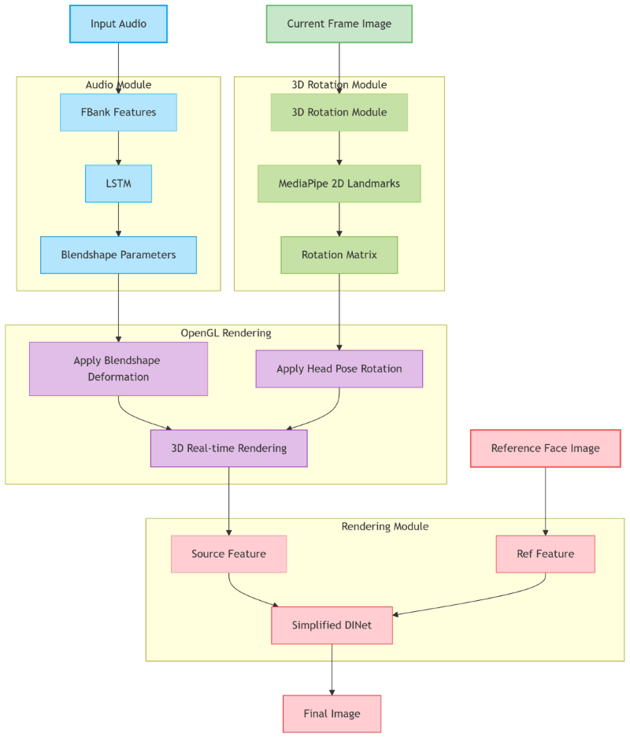

<div align="center">


# DH_live (mini)

> Web · Real-time · Mobile · Smallest on the Web

[Chinese](README.md) | [English](README_en.md)

Online Application: [matesx.com](matesx.com)
</div>

Notes: Currently, the project mainly maintains DH_live_mini, the fastest 2D video digital human solution, bar none. The project includes a web inference case that does not rely on any GPU and can run in real-time on any mobile device.

We have open-sourced the ultra-lightweight multi-platform digital human dialogue engine [MatesX](https://github.com/kleinlee/MatesX). It is the evolution of DH_live. Memory · Expression · Action · Multi-platform · Lightweight, compatible with Windows/macOS/iOS/Android/Mini-program
<div align="center">

</div>
DHLive_mini direct inference demo on mobile browser [bilibili video](https://www.bilibili.com/video/BV1UgFFeKEpp)

## News
- 2025-01-26 Minimized and simplified the web resource package, with gzip resources smaller than 2MB. Simplified video data, halving the data size.
- 2025-02-09 Added ASR entry and one-click avatar switching.
- 2025-02-27 Optimized rendering, removed reference video; now only one video segment is needed for generation.
- 2025-03-11 Added CPU support for DH_live_mini.
- 2025-04-09 Added support for long videos on iOS 17 and above.
- 2025-04-25 Added a complete real-time dialogue service, including the full process of vad-asr-llm-tts-digital human. See web_demo/server_realtime.py.
- 2025-09-23 The ultra-lightweight multi-platform digital human dialogue engine [MatesX](https://github.com/kleinlee/MatesX) has been open-sourced. It is the evolution of DH_live. Memory · Expression · Action · Multi-platform · Lightweight, compatible with Windows/macOS/iOS/Android/Mini-program

## Comparison of Digital Human Solutions

| Solution Name | Single Frame Compute (Mflops) | Usage Method | Face Resolution | Applicable Devices |
|------------------------------|-------------------|------------|------------|------------------------------------|
| Ultralight-Digital-Human（mobile） | 1100 | Individual Training | 160 | Mid-to-high-end mobile APPs |
| DH_live_mini | 39 | No Training Required | 128 | All devices, Web & APP & Mini-program |
| DH_live | 55046 | No Training Required | 256 | GPUs 30-series and above |
| duix.ai | 1200 | Individual Training | 160 | Mid-to-high-end mobile APPs |


### Key Features
- **Lowest Compute**: The compute power for inferring one frame is 39 Mflops. How small is that? Smaller than most face detection algorithms on mobile.
- **Smallest Storage**: The entire web resource can be compressed to 3MB!
- **No Training Required**: Ready to use out of the box, no complex training process needed.

### Platform Support
- **windows**: Supports video data processing, offline video synthesis, and web server.
- **linux&macOS**: Supports video data processing and building a web server, but does not support offline video synthesis.
- **Web & Mini-program**: Supports direct opening by the client (you can search for the mini-program "MatesX数字生命", which has the same functionality as the web version).
- **App**: Call the web page via webview or refactor into a native application.

| Platform | Windows | Linux/macOS |
|---------------|---------------|-------------|
| Raw Video Processing & Web Resource Preparation | ✅ | ✅ |
| Offline Video Synthesis | ✅ | ❌ |
| Build Web Server | ✅ | ✅ |
| Real-time Dialogue | ✅ | ✅ |

## Checkpoint
All checkpoint files are moved to [BaiduDrive](https://pan.baidu.com/s/1jH3WrIAfwI3U5awtnt9KPQ?pwd=ynd7)
[GoogleDrive](https://drive.google.com/drive/folders/1az5WEWOFmh0_yrF3I9DEyctMyjPolo8V?usp=sharing)

## Easy Usage (Gradio)

For first-time use or to get the full process, please run this Gradio.
```bash
python app.py
```

## Usage

### Create Environment
First, navigate to the `checkpoint` directory and unzip the model file:
```bash
conda create -n dh_live python=3.11
conda activate dh_live
pip install torch --index-url https://download.pytorch.org/whl/cu124
pip install -r requirements.txt
cd checkpoint
```
Note: If you don't have a GPU, you can install the CPU version of pytorch: pip install torch

Download and unzip checkpoint files.
### Prepare Your Video
```bash
python data_preparation_mini.py video_data/000002/video.mp4 video_data/000002
python data_preparation_web.py video_data/000002
```
The processed video information will be stored in the ./video_data directory.
### Run with Audio File ( linux and MacOS not supported!!! )
The audio file must be a single-channel 16K Hz wav file format.
```bash
python demo_mini.py video_data/000002/assets video_data/audio0.wav 1.mp4
```
### Web demo
Please replace the corresponding files in the assets folder with the assets files from the new avatar package (e.g., video_data/000002/assets).
```bash
python web_demo/server.py
```
You can open localhost:8888/static/MiniLive.html.

If you want to experience the best streaming dialogue effect, please read [web_demo/README.md](https://github.com/kleinlee/DH_live/blob/main/web_demo/README.md) carefully, which contains a complete commercial-ready project.
### Authorize
Commercial application of the web part involves avatar authorization (removing the logo): visit [Authorization Instructions] (www.matesx.com/authorized.html)

Upload your generated combined_data.json.gz. After authorization, download the new combined_data.json.gz and overwrite the original file to remove the logo.
### Online Application
Visit the [matesx web application](https://www.matesx.com), or search for "MatesX数字生命" in the mini-program.

## Algorithm Architecture Diagram
<div align="center">

</div>

## License
MIT License

## Contact
<center>

| WeChat Group | QQ Group |
|---------------------------------------------------------------|-----------------------------------------------------------|
|  |  |

</center>