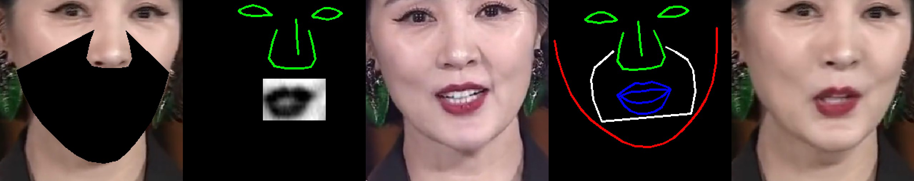

## Overview
This project involves training two separate models for a face generation system: an audio model to extract mouth movement patterns and a rendering model to generate the final face. Each model requires its own data preparation and training process.
## Audio Model Training (LSTM)
The audio model is distilled from other models and is designed to extract mouth movement patterns from audio input. The code for this model will be released soon.
## Render Model Training (simplified DiNet)
### Original Data Structure
Please ensure that your data directory structure is organized as follows:
```bash
|--/dir_to_data
|  |--/video0.mp4
|  |--/video1.mp4
|  |--/video2.mp4
```
### Data Preparation
Next, prepare your video using the data_preparation script. Replace YOUR_VIDEO_PATH with the path to your video:
```bash
python train/data_preparation_face.py dir_to_data
```
After running the script, your data directory structure should be updated to:
```bash
|--/dir_to_data
|  |--/video0
|  |  |--/keypoint_rotate.pkl
|  |  |--/face_mat_mask.pkl
|  |  |--/image
|  |      |--/000000.png
|  |      |--/000001.png
|  |      |--/...
|  |--/video1
|  |  |--/keypoint_rotate.pkl
|  |  |--/face_mat_mask.pkl
|  |  |--/image
|  |      |--/000000.png
|  |      |--/000001.png
|  |      |--/...
```
### Data Validation
Verify the prepared data using the following script:
```bash
python train/train_input_validation_render_model.py dir_to_data
```
you will get the following image:

### Training 
```bash
python train/train_render_model.py ----train_data dir_to_data
```
### Monitoring Training Progress
Monitor the training progress using TensorBoard.
```bash
tensorboard --logdir=checkpoint/Dinet_five_ref
```
Then, open http://localhost:6006/ in your web browser to view the training metrics.
